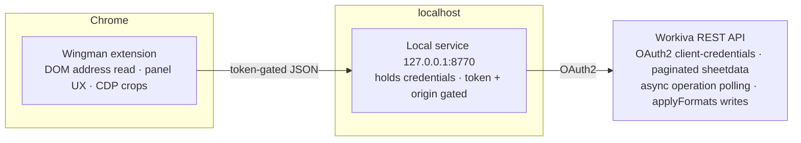

# Wingman

A Chrome extension + local Python service that sits beside a live spreadsheet in a
regulated reporting platform (Workiva) and finds defects an exported file can't show
you — then fixes the narrow subset that is provably safe, confirm-before-write, with
readback and revert.


CI runs the full suite on Python 3.11 and 3.12: **472 pytest** server tests plus
**243 node** extension tests.

## Demo

Demo GIF coming — scan → triage lanes (All / Fixable / Review) → "Fix all N safe" →
readback receipt, on the synthetic **City of Riverton** demo workbook. No screenshots
in this repo ever come from real client data.

## Why this exists

Government financial reports (ACFRs) are produced in cloud platforms where a wrong
write is expensive and undo is unreliable. Reviewers repeatedly hunt for the same
defect classes: hardcodes hidden inside formulas, broken references, sub-WCAG
contrast, stray label whitespace, format drift, years rendering as "2,025". Wingman
encodes those defect classes as detectors and — critically — refuses to auto-fix
anything it cannot reverse. The interesting engineering is the safety model, not the
scanning.

## Architecture



The extension never touches the platform API directly. It reads the active cell
address from the page DOM (never from pixels), and brokers every request through the
local service, which holds the credentials and enforces the write gates.

## The safety model (the actual point)

- Every fix: dry-run diff → explicit confirm → apply → **readback** (re-read and
  compare) → revert on mismatch
- **Scale guard** — refuses any format write that would lossily rescale stored values
  ([ADR-0007](docs/adr/0007-scale-guard-and-formula-fetch-default.md))
- **Currency-symbol guard**
  ([ADR-0010](docs/adr/0010-currency-symbol-show-guard.md)), **expected-account write
  gate** ([ADR-0012](docs/adr/0012-expected-arid-write-gate.md)), and a workbook
  allowlist for `/apply` — writes fail closed until a workbook is explicitly listed
- Surfaced-not-fixed lane: judgment calls are reported, never written
- PII-safe activity log: counts, coordinates, hashes — never cell values or formulas
- [17 ADRs](docs/adr/) documenting each decision, including the ones that went the
  hard way

## Quickstart

```bash
git clone https://github.com/dbett4/wingman.git
cd wingman
./setup.sh                 # checks Python, creates .env, runs a smoke test
# add your own Workiva OAuth client-credentials to .env
./run-service.sh           # local service on 127.0.0.1:8770 (leave running)
```

Then load `extension/` as an unpacked extension (`chrome://extensions` → Developer
mode → Load unpacked), open a Workiva spreadsheet, and click the Wingman toolbar
icon. Without credentials, `cd server && python3 app.py` still starts the service,
and the detector self-test runs — see `python3 server/detectors.py`.
(`./run-service.sh` itself requires credentials and exits early without them.)

## Testing

```bash
pip install pytest                 # the only test dependency
python3 -m pytest server/          # 472 tests
node extension/content.test.js     # 243 tests
scripts/smoke_check.sh             # route + gate smoke, incl. guarded-route 403
```

CI runs all of the above on Python 3.11 and 3.12.

## Status

Extracted from production tooling used on live government financial reports (ACFRs).
Platform-specific to Workiva's API today; the detector / fixer / readback pattern is
platform-agnostic. Not affiliated with or endorsed by Workiva.

## Author

Dave Bettner — [davebettner.com](https://davebettner.com)
