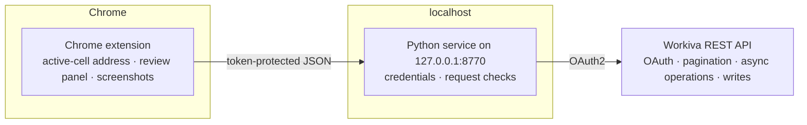

# Wingman

## The problem this answers

A financial statement can “tie out” and still be wrong in ways an export will not
show: broken live links, hardcoded values hiding inside formulas, formatting drift,
years rendered as `2,025`, low-contrast text, stray label whitespace.

Reviewers need those defects found in the live workbook. Most of them still need
human judgment. Only a narrow set should ever be auto-fixed — and only if the tool
can prove the fix and undo it.

**One-line pitch:** find workbook defects in the live editor; automate only the
fixes you can confirm, read back, and reverse.

Wingman is a Chrome extension plus a local Python service for that loop in
Workiva-shaped reporting workbooks. Fictional demo data only; not affiliated with
or endorsed by Workiva.

> **Provenance.** Sanitized public extract published August 2026; Git dates are
> publication dates, not the original private development timeline. City of
> Riverton data is fictional — no client data or credentials are included.


## Try it without credentials

```bash
python3 server/demo.py     # Python 3.11+, standard library only; default port 8771
```

Open port 8771 on your local machine. In an Amp orb, run `amp orb services ensure`
and open its **Wingman demo** portal instead.

The fictional City of Riverton workbook runs through the **actual extension panel,
service routes, detectors, and fixer** against a session-isolated simulated Workiva
API. Inspect a selected cell, or open Scan to preview and apply a label, year-format,
or contrast fix; inject a mismatched write to exercise readback/restore; download a
fresh review packet. No account or
extension installation is needed. No sample data comes from a client.

This is a workflow demonstration, **not live Workiva integration evidence or a
detector-accuracy benchmark**. Formula results are seeded, and external checks,
vision, publishing, OAuth, async jobs, and collaborative edits are not simulated.
See the [two-minute walkthrough and simulation boundary](docs/demo.md).

## Selected-cell inspector

On first use, Wingman opens on **Inspect**, without reading the workbook or starting a scan.
Select one spreadsheet cell and choose **Inspect selected cell** to see stored
content/formula, calculated result, and native value format separately. Zero,
blank, unavailable content, and unrecognized content types remain distinct.
A stored number is not automatically a defect: an approved frozen value may be intentional.

Inspection is read-only and does not log cell content. It clears evidence when
selection or page context changes and rejects late replies for earlier selections.
The service repeats both cell reads and discards changed evidence; this is **not
an atomic or revision-pinned snapshot**. Inspect again after edits.

**References & links** separates addresses and numeric literals in the formula
from Workiva link metadata. Cell-level destination links follow their recorded
source anchor to an exact cell; covering range links remain separate evidence.
Disconnected links can retain a value. Failed or incomplete metadata reads do not
become “unlinked,” and connected does not mean correct or up to date.

**Read source values** explicitly reads up to 100 cells across 10 ranges. Formula
references use the selected content revision; incoming links use their recorded
source revisions, never a latest-revision substitute. Formula extraction is
text-only, not evaluation or reconciliation. Named, external, structured, computed,
and unbounded references remain unresolved. **Inspect [cell] source** follows one
supported table-cell step at its recorded revision. A return trail retains earlier
evidence and the original value without moving Workiva's selection or rereading
on return. Cycles and the 10-step limit are explicit; cancellation, timeout and
scope changes reject late replies. Historical source views do not borrow today's
native format or range-link lists, or infer a source workbook from the origin.
Named-sheet references at those steps remain unresolved without a verified workbook
identity. Inline rich-text links, non-table sources and automatic full-chain
expansion are not supported.

When source-sheet membership is verified at the recorded revision, **Open source
sheet** opens that sheet's current Workiva view in a separate tab. The evidence
and return trail stay in the original tab. This does not select the source cell
or open its historical revision; today's values may differ. Unknown or mismatched
locations offer no link. The installed-extension regression tests keyboard opening
and return using fictional pages; live cross-sheet acceptance remains open.

Engagement policy, document comments, and downstream report checks are not
connected. Page IDs do not prove client, fiscal year, or working-copy
authority. Existing Scan, Checks, and Workbook workflows remain separate and
manual. Live Workiva compatibility and the browser-to-service connection still
require validation; this slice does not change the localhost service architecture.

## Connection and recovery

Open **Connection** below the panel header, then choose **Check connection**.
Opening the view sends no check. The explicit check calls the guarded
`/api/connection` endpoint without requesting OAuth or reading a workbook.

- **Service connected** means the extension's token was accepted and Workiva
  credential fields are present on the backend. It does **not** establish valid
  Workiva credentials, workbook permission, or which machine hosts the backend.
- Missing extension configuration, missing backend credentials, rejected service
  access, unreachable service, timeout, incompatible response, and extension
  reload each have a distinct recovery message.
- The fetch times out after eight seconds. **Stop waiting** ignores late replies;
  it does not claim to cancel an operation at the backend. Leaving the view or
  reloading the extension also invalidates pending replies.
- **Copy diagnostics** includes the result, timestamp and connection facts, but
  no credentials, workbook identifiers, cell content or upstream error bodies.
- The fictional demo reports **Demo connection**, never live authorization.

This is connection diagnosis, **not a completed guided installer**. The current
build still addresses `http://127.0.0.1:8770`. The [private deployment profile](deploy/README.md)
connects that address to a VPS backend through an encrypted SSH forward. Its
connection-only service enforces read-only mode, uses a private systemd token,
and has no Workiva credentials or non-loopback egress. **Read-only — repairs
disabled** in Connection reports that server-wide mode; it is distinct from a
read-only diagnostic on the ordinary service. Provisioning and live verification
are separate from running the check. Clean-machine installation and authorized
Workiva compatibility remain open in [G1](docs/roadmap.md#g1-a-reviewer-can-install-connect-and-recover-without-developer-help).

## Why I built it

Financial reports often live in cloud editors where an exported file omits useful
context. Wingman turns repeated government financial-reporting review checks into
detectors. It does not try to repair every finding. A change is automated only when
the service can capture the original state, predict the result, read the cell back,
and attempt to restore the original value if the result differs.

## Proof signal

The tests cover cell evidence, target validation, detectors, and readback/recovery.
Browser regressions exercise the inspector's delayed replies, navigation, keyboard
access, and the existing preview/apply workflow against disposable fictional data.
CI runs Python/extension tests on Python 3.11 and 3.12 and browser tests on Python 3.12.
Optional vision and external-integration tests report skips when unavailable.

## Architecture



The extension reads the active cell address from the page and sends requests to the
local service. Credentials stay in that local process. The service checks the target
workbook and account before it allows a write.

## Write controls

- Writes are dry runs until the user confirms them.
- Before writing, the service re-reads the cell and captures its prior state. Apply
  is not yet bound to an immutable preview, and this is not a concurrent-edit lock.
- After writing, it reads the cell again. A mismatch triggers a best-effort restore
  from the saved state. Restore requests can fail and are not yet verified by a
  second readback; this is not guaranteed undo.
- Scale and currency checks prevent format changes from altering stored values or
  adding a currency symbol where it does not belong.
- The service refuses writes outside an explicit workbook allowlist.
- Findings that require accounting judgment or UI-only work remain review items.
- Activity logs contain coordinates, counts, and hashes, not cell values or formulas.

The [architecture decision records](docs/adr/) document the individual detector and
write-path choices, including rejected approaches and measured false positives.

## Run it

```bash
git clone https://github.com/dbett4/wingman.git
cd wingman
./setup.sh                 # creates a per-install token + .env, then runs smoke checks
# add your Workiva OAuth client credentials to .env
./run-service.sh           # starts the service on 127.0.0.1:8770
```

Load `extension/` as an unpacked extension from `chrome://extensions`, open a Workiva
spreadsheet, and click the Wingman toolbar icon. Without credentials, you can still
start the detector self-test with `python3 server/detectors.py`. The full service
launcher exits early if credentials are missing.

`./setup.sh` writes the same generated local token to the gitignored `.env` and
`extension/local-config.js`. Guarded routes have no packaged fallback token and stay
disabled if setup has not completed. Reload the unpacked extension after setup.

`/api/checks` is an optional adapter for a separate `run_checks.py` installation.
That external checks CLI is not included here; `/api/status` reports whether it is
available, and the adapter returns an explicit unavailable result when it is absent.

## Test it

```bash
pip install pytest
python3 -m pytest server/
node extension/content.test.js
node --test extension/background.test.js extension/setup.test.js
scripts/smoke_check.sh             # route and write-gate smoke checks
```

The demo HTTP tests are included in `pytest server/`. For the browser workflow:

```bash
npm install -g agent-browser@0.37.1
agent-browser install             # add --with-deps on a fresh Linux CI runner
python3 -m pytest scripts/test_demo_browser.py -q
```

It starts and stops its own demo, checks preview/apply/recovery through the rendered
panel, and verifies narrow-layout overflow and control heights. In an orb,
`agent-browser` is preinstalled; use `.venv/bin/python -m pytest` if your shell has
not activated the repository virtual environment.

For the installed MV3 connection path, with Python Playwright and its Chromium
already installed:

```bash
python3 -m pytest scripts/test_extension_browser.py -q -s
```

This separate test requires a **free loopback port 8770**. It copies only declared
extension assets into a disposable profile, supplies fictional configuration,
and serves a fictional page without contacting Workiva. It exercises the real
worker, HTTP handler, standalone setup page, panel-message acknowledgment,
failure/recovery states, keyboard focus and narrow layouts. It does not prove
live Workiva or remote-host compatibility. Browser sandboxing stays
enabled. On hosts using an existing Chrome setuid sandbox, select that installed
helper with `CHROME_DEVEL_SANDBOX`; do not disable sandboxing to run the test.

## Amp orbs

`.agents/setup` prepares Python 3.12 in `.venv` with pytest and the optional
NumPy/Pillow vision dependencies. It uses uv and Node from the orb base image;
the extension needs no npm install. Repository login shells activate `.venv`
automatically, so the test commands above work without manual activation.
Setup is idempotent and reuses installed dependencies on warm snapshots.

`.agents/resume` generates the local service/extension token after snapshot
activation and preserves it on subsequent wakes. Setup does not create credentials
or start services. Workiva OAuth credentials and the external checks CLI remain
optional, user-supplied integrations; live Workiva operations require credentials.
For manual dependency changes, use `uv pip install --python .venv/bin/python`.

`.amp/services.yaml` declares only the credential-free demo. `amp orb services ensure`
starts it with a health check and an authenticated portal; it never starts the live
Workiva service. Browser sessions and demo state are disposable.

## Next milestones

The [improvement roadmap](docs/roadmap.md) tracks the remaining write-safety,
detector-evaluation, review-history, and reviewer-pilot work. The demo is the first
milestone, not a claim that those capabilities already exist.

## Scope

This repository was extracted from tooling used on live government financial reports.
It currently targets Workiva's API and is not affiliated with or endorsed by Workiva.
The detector, readback, and restore pattern can be applied to other systems, but that
portability is not implemented here.

Built by [Dave Bettner](https://davebettner.com).
