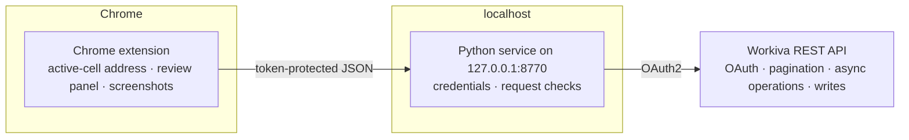

# Wingman

Wingman is a Chrome extension and local Python service for reviewing financial
reporting workbooks in Workiva. It finds problems that disappear in an export, such
as broken links, formula hardcodes, formatting drift, and years displayed as `2,025`.
For the small set of changes it can check and undo, it can also apply the fix.


CI runs 472 Python tests and 243 extension tests on Python 3.11 and 3.12.

## Current demo

The demo uses a fictional City of Riverton workbook. It scans the workbook, separates
mechanical fixes from items that need review, and shows the readback result after a
confirmed write. No screenshots or sample data in this repository come from a client.

## Why I built it

Financial reports often live in cloud editors where an exported file omits useful
context. Reviewers still need to catch broken references, hardcoded values inside
formulas, low-contrast text, stray label whitespace, and inconsistent number formats.

Wingman turns the checks I saw repeatedly in government financial reporting work into
detectors. It does not try to repair every finding. A change is automated only when
the service can capture the original state, predict the result, read the cell back,
and restore the original value if the result differs.

## Architecture



The extension reads the active cell address from the page and sends requests to the
local service. Credentials stay in that local process. The service checks the target
workbook and account before it allows a write.

## Write controls

- Writes are dry runs until the user confirms them.
- Before writing, the service saves the prior state and checks that the target has not
  changed.
- After writing, it reads the cell again. A mismatch triggers a restore from the saved
  state.
- Scale and currency checks prevent format changes from altering stored values or
  adding a currency symbol where it does not belong.
- The service refuses writes outside an explicit workbook allowlist.
- Findings that require accounting judgment or UI-only work remain review items.
- Activity logs contain coordinates, counts, and hashes, not cell values or formulas.

The [architecture decision records](docs/adr/) document the individual detector and
write-path choices, including rejected approaches and measured false positives.

## Run it

```bash
git clone https://github.com/dbett4/wingman.git
cd wingman
./setup.sh                 # checks Python, creates .env, runs a smoke test
# add your Workiva OAuth client credentials to .env
./run-service.sh           # starts the service on 127.0.0.1:8770
```

Load `extension/` as an unpacked extension from `chrome://extensions`, open a Workiva
spreadsheet, and click the Wingman toolbar icon. Without credentials, you can still
start the detector self-test with `python3 server/detectors.py`. The full service
launcher exits early if credentials are missing.

## Test it

```bash
pip install pytest
python3 -m pytest server/          # 472 tests
node extension/content.test.js     # 243 tests
scripts/smoke_check.sh             # route and write-gate smoke checks
```

## Scope

This repository was extracted from tooling used on live government financial reports.
It currently targets Workiva's API and is not affiliated with or endorsed by Workiva.
The detector, readback, and restore pattern can be applied to other systems, but that
portability is not implemented here.

Built by [Dave Bettner](https://davebettner.com).
